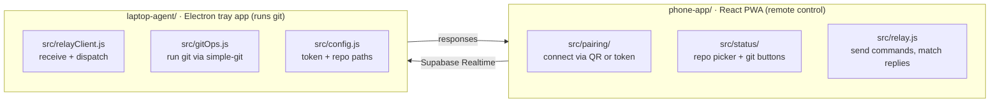

# Git Relay

Run git from your phone against repos on your laptop. Check status, read diffs,
stage files, commit, push, browse recent commits, and switch or create branches
— from a browser, without exposing your laptop to the internet. Add as many
repos as you like in the tray app and pick which one to work in from the phone.

## How it works

Three pieces, no inbound ports and no code ever leaving your machine:

```
Phone (PWA)  <--->  Supabase Realtime  <--->  Laptop (Electron tray app)
                     (message relay)            (runs the actual git commands)
```

The relay only passes messages. Both sides connect *outbound* to a Supabase
channel named after a shared pairing token, so there's nothing to port-forward
and no server holding your source. Git itself only ever runs on the laptop.

## Multiple laptops, multiple phones

The pairing token *is* the channel name, so each tray app generates its own
token and lives on its own channel. Nothing crosses between them.

- **One phone, several laptops.** Save as many connections as you like and
  switch with the picker at the top of the status screen. Each entry keeps its
  own token, so "Work laptop" and "Home laptop" stay separate.
- **Several phones, one laptop.** Everyone who enters the same token reaches
  the same tray app and sees the same repo — that's what sharing a token means.
  Responses are addressed by request id, so one phone never picks up another's
  reply.
- **Different people.** Give each person their own tray app and its own token.
  A command sent on one token is never delivered to another.

The token is the only credential: anyone holding it can run git against every
repo you've added to that laptop. Treat it like a password, and use the
switcher's **Unpair** to forget a laptop from a phone.

## Multiple repos on one laptop

The tray app holds a list of repos rather than a single path. Open **Pairing &
Settings**, click **Add a repo folder…**, and pick a git repository — add as
many as you want; non-git folders are rejected. The phone shows a **Repository**
picker once it connects, and every action (status, diff, stage, discard,
commit, push, pull, recent commits, branches) runs against the repo selected
there. Adding or removing a repo in the tray app takes effect on the phone's
next refresh — no re-pairing or restart.

## Branches

The status screen shows the repo's current branch in a picker: choose a
different local branch to check it out, or use **New branch…** to create one
off the current HEAD and switch to it. **Manage branches…** lists every other
local branch with a **Delete** action (a safe delete — it refuses an unmerged
branch or the one you're currently on, same as `git branch -d`). Switching,
creating, or deleting a branch refreshes status and recent commits so nothing
stale is left on screen. Any of these fail (and report the git error back to
the phone) the same way they would from the command line — for example, if you
have uncommitted changes that conflict with the target branch.

## Syncing with the remote

Below the branch picker, the status screen shows how far the current branch is
ahead of or behind its upstream. **Pull** fetches and merges from the remote;
**Push** sends your commits — and if the branch has never been pushed before,
it sets the upstream automatically (`git push -u origin <branch>`) instead of
failing with "no upstream branch".

## Discarding changes

Every unstaged or untracked file gets a **Discard** action next to **Diff**.
For a tracked file this reverts the working copy to match the index (or HEAD,
if it isn't staged) — any staged content is left untouched. For an untracked
file it deletes it. Both ask for confirmation first, since neither can be
undone from the phone.

## Packages

| Path | What it is |
|---|---|
| `laptop-agent/` | Electron tray app. Holds the pairing token, owns the list of repo paths, executes git via `simple-git`. |
| `phone-app/` | Vite + React PWA. Pairs by QR or pasted token, drives the git operations. |

## Repository structure

Two packages and nothing else: `laptop-agent/` is where git actually runs,
`phone-app/` is the buttons you press, and Supabase Realtime is just the wire
between them.



```
Git Relay/
├── laptop-agent/             # Electron tray app — holds the token, owns the repo list, runs git
│   ├── assets/               #   tray icon image
│   └── src/
│       ├── main.js           #   Electron entry: tray menu, windows, wiring
│       ├── gitOps.js         #   the actual git commands, via simple-git
│       ├── relayClient.js    #   receives commands off the relay, calls gitOps
│       ├── config.js         #   loads/saves token + repo paths (~/.git-relay-agent)
│       ├── pairing.js         #  generates the pairing token (= the channel name)
│       ├── preload.js        #   bridge for the pairing window
│       └── pairingWindow.html #  the "Pairing & Settings" window UI
│
└── phone-app/                # Vite + React PWA — the remote control in the browser
    ├── public/               #   PWA icons
    └── src/
        ├── App.jsx           #   chooses pairing vs status screen, manages saved laptops
        ├── pairing/          #   PairingScreen — scan QR or paste token
        ├── status/           #   StatusScreen — repo picker + git action buttons
        ├── relay.js          #   send commands over Supabase, match replies by id
        ├── connections.js    #   saved laptops (tokens) in localStorage
        ├── supabaseClient.js #   builds the Supabase client from .env
        └── fakeRelay.js      #   in-memory relay stand-in used by tests
```

Test files (`*.test.js` / `*.test.jsx`) sit next to the file they cover in both
`src/` folders.

## Setup

Both packages need Supabase credentials. Copy the examples and fill in your
project's values:

```bash
cp laptop-agent/.env.example laptop-agent/.env
cp phone-app/.env.example phone-app/.env
```

Then install and run each side:

```bash
cd laptop-agent && npm install && npm start
```

```bash
cd phone-app && npm install && npm run dev -- --host
```

Open the tray icon → **Pairing & Settings** to add your repos and reveal the
pairing token. On the phone, browse to the dev server's LAN address and enter
that token, then pick a repo from the picker.

The `--host` flag is what makes the dev server reachable from your phone; both
devices must be on the same network. Note that the QR scanner needs camera
access, which mobile browsers only grant over HTTPS or `localhost` — over a
plain `http://` LAN address, paste the token manually instead.

## Tests

```bash
cd laptop-agent && npm test
```

```bash
cd phone-app && npm test
```

## Security notes

Full threat model in [SECURITY.md](SECURITY.md); the short version:

**The pairing token is the only credential.** Anyone holding it can read diffs
and history, commit, push with your git credentials, pull, discard uncommitted
work, and delete branches — across *every* repo registered in the tray app.
Treat it like a password. It lives in `~/.git-relay-agent/config.json`, outside
this repo, and is never committed. To rotate it, delete `pairingToken` from that
file and restart the tray app.

**The Supabase anon key is public.** `VITE_SUPABASE_ANON_KEY` is compiled into
the phone app's bundle, so anyone who loads the page has it. Therefore:

- use a **dedicated Supabase project** for Git Relay, not one holding anything else
- enable **row level security on every table** in it — a table without RLS is
  readable and writable by anyone with that key
- enable [Realtime Authorization](https://supabase.com/docs/guides/realtime/authorization)
  so key holders can't subscribe to or broadcast on arbitrary channels

The key does not reveal a pairing token, and a 24-byte random token isn't
guessable, so your channel stays private either way — the exposure is the rest
of the project the key unlocks.

`.env` files (and `.env.local`, `.env.production`, …) are gitignored; only
`.env.example` templates are tracked.

The agent must be running for the phone to do anything. If the phone shows
"Offline", start the tray app.

## License

[MIT](LICENSE)
